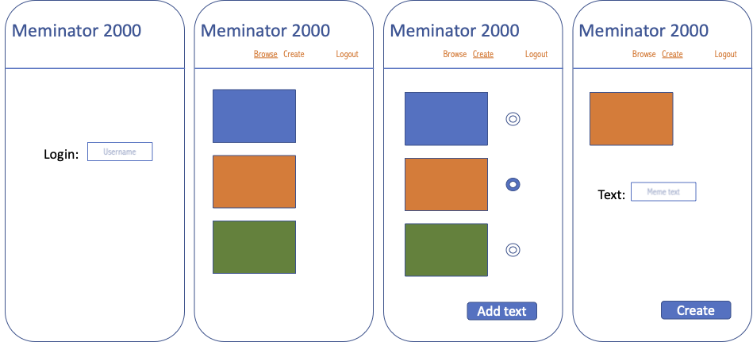
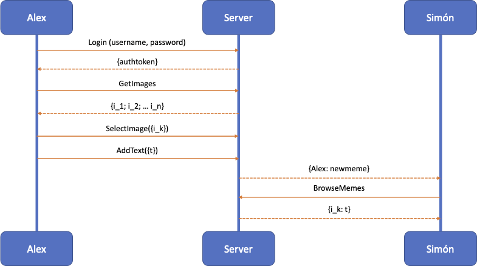

# Meminator 2000

## Description deliverable

### Elevator pitch

The world needs more memes---there just aren't enough out there.  Plus, how fun would it be to create and share them with your people?  The Meminator 2000 is the solution.  It will allow you to create your own, personal memes and save them to a database where you and your friends can enjoy them forever.

### Design

Note, there is one additional screen (not shown) for the create functionality that displays the created meme.

Here is a sequence diagram that shows how to people would interact with the backend to vote.

### Key features

- Secure login over HTTPS
- Ability to select an image to use for your meme
- Display of image choices
- Ability to insert text in image
- Notification to all users of newly created meme
- Memes are persistently stored
- Ability to browse and regenerate stored memes

### Technologies

I am going to use the required technologies in the following ways.

- **HTML** - Uses correct HTML structure for application; four HTML pages: login, image selection, text input, browsing.
- **CSS** - Application styling that looks good on different screen sizes, uses good whitespace, color choice and contrast.
- **JavaScript** - Provides login, image choice display, image selection, text input and meme rendering, notification of newly created memes, backend endpoint calls.
- **Service** - Backend service with endpoints for:
  - login
  - retrieving image choices
  - submitting text overlays
  - retrieving created memes
- **DB** - Store users, images (url) and associated text in database.
- **Login** - Register and login users. Credentials securely stored in database. Can't create memes unless authenticated.
- **WebSocket** - As an user creates a meme, all other users are notificed (can these be accumulated and served upon login, for those not online?)
- **React** - Application ported to use the React web framework.
