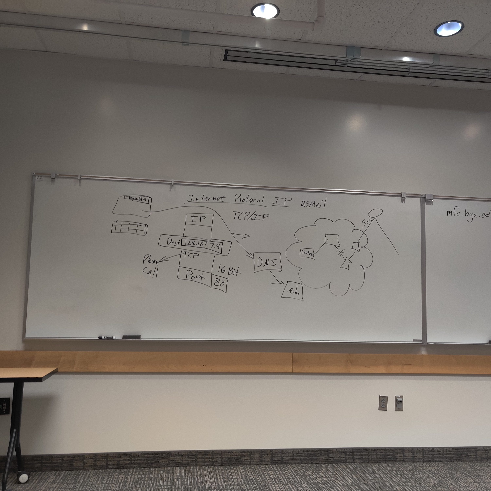
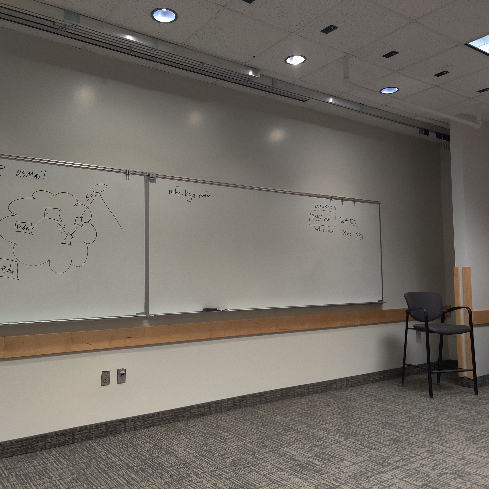

# Week 1 (this is out of order because Mark subbed)
1. Why are you here and why and I here
	Rah rah stuff---web site that the world can see
2. Very applied, learning tons of new stuff---be ok with that
3. Jump to GITHUB repo and explain
	Build Simon and "Startup company" in parallel
4. Spend lots of time, focus on mastery, stay up to date
5. Codepen?
	a. HTML is structure, CSS is style, JS is behavior
		browser renders HTML code
			it doesn't throw errors, it just does its best and you have to "think like the computer" to debug (but also printf/comment technique)---you have to fix stuff or it will come back to bite you
	b. not all browsers play the same (show rotating border gradient doesn't work in safari problem (what about FireFox?) Chrome has better development tools (according to Mark).  Standardize on Chrome
	c. W3schools.com tutorials
	d. JS is dangerous because browsers can capture all kinds of events
6. History
	a. IPv4 (32bit addressing), IPv6 (128bit addressing)
	b. Packet: address, IP, TCP, UDP, port (16bit addressing)
	c. browser
	d. routers
	e. DNS (.com, .edu, .gov, .org, etc.?) subdomain servers
		"trick is getting other people to use your DNS"
		weakness to attack---bottleneck
	f. AWS (or whatever: google, Facebook, etc.)
			virtual machines
	g. what about firewall???
	h. Net neutrality
	i. network address translation (NAT)
		needed because we haven't adopted IPv6
		lets us squeeze more machines into IPv4 by multiplexing using ports?
	j. how to register a new machine/address onto the internet?
		used to be just the address
		but now more chaotic
	k. punchcards-->personal computer-->virtual servers (command line)

7. Use google to find answers and don't pay
	how to weed out the bad stuff
8. AWS Console
	a. spin up new server whenever
	b. always save to GitHub!!!
	c. use cs260.pem for class stuff so I don't have to chase key files
	d. if you create a new key pair, make sure you download it and save it somewhere (local/safe)
	e. terminate/stop/start server, etc.
	g. launch
	h. paste address into browser (use http?)
	
	i. manage firewall on security tab
	j. don't be afraid to make mistakes---do several server setups so it's no big
	k. we didn't give it a name yet/DNS address?
		Route53
		how to connect to new server(s)? And disconnect from terminated ones?
			edit Caddyfile
	l. HTTPS certificate
9. SSH and command line
	a. we ssh into this server we are creating
	b. check out index.html
 	c. what is Caddy?
		edit Caddy file
	d. vi, emacs, nano, (s)ftp
	e. don't worry about firehose syndrome

# Week 2 (this is out of order because Mark subbed)

1. Lee explains hard things like ask yourself first really well
	a. I used to ask the smart guy down the hall, but then I started feeling bad...
	b. lifetime learning skill to say figure it out
2. Three levels of "server":
	a. We can use about:blank, open inspector and write html, css and js right in the browser (local, no server)
	b. you can also run a server on your local machine (local, server)
	c. then, nonlocal server
3. What is websocket? How is it peer-to-peer and how does this give us more power?
4. You CANNOT get behind--> goes from being an awesome class to NO!!!!!!
5. Caddy is a multi-reverse proxy/gateway that figures out which service to serve (we have two: Simon, Startup)
	what is the bit about certificates
	adding services (instruction)
		daemon
6. Node.js is just javascript running outside the environment---pull the runtime engine out of the browser and use it from the command line
7. Talk about mental models and their importance
8. OS
	a. Mac/Linux are Posix compliant
	b. Windows isn't--powershell, so need to get gitbash or something else Posix compliant
	c. WSL is windows subsystem for Linux---be careful
9. Console
	a. historical pic
	b. console
		file explorer (command line)
		execute programs
	c. deployment script---pushes dev code to prod server
		show doing it by hand first?
	d. if server changes make AWS (or whatever) fuss about an unknown host, go to .ssh directory (on local machine?) and delete knownhosts? file
10. Visual Studio Code to develop
	a. GitLens extension
	b. Live Server extension
	c. command shift P
	d. command P
11. Use AWS Secrets to store stuff like .pem file if you want to be able to get it from multiple machines, share it, etc.
12. Git
	a. use command line
	b. editor
	c. visualizing git
	d. what is the gitconfig slide for?
13. Github
	a. Don't nest repos

# Week 3
1. Elevator pitch
 	a. passion
	b. what is the problem?
 	c. what is the win?
	d. how you are going to do it?
2. dropped "changing root domain" from course?
3. lots of time to answer questions before we covered anything
4. we don't have the browser just read files directly from our HD (if we are just local, especially) because of permissions/security issues/complexity
5. <!DOCTYPE html> means we are using HTML 5
6. language attribute just lets google, etc. know what language this is (in case it wants to find that kind of thing or translate or whatever)
7. localhost 127.0.0.1 loopback (LiveServer uses this)
8. TBL is famous WebFather because he thought of anchor tags---anyone can change the world
9. HTML steals from SGML
10. DOM (doc object model) is a tree representation in memory
11. HTML has styling attributes (like width) that are now deprecated by CSS
12. HTML Slide (3.1) "Header" is overloaded and misleading
13. CodePen assumes <!DOCTYPE html><html></html> and doesn't include it
14. Make clean structure with as much semantics as possible (for readers, google, etc.)
15. <forms> are kind of deprecated by JS now, but still...
16. why does controls=false not get rid of controls in Media code?
17. where to find videos, etc that you can access in CodePen?
	look at webpage source and link there or just host it locally?
18. Is there cool SVG repos somewhere?
19. In HTML, you have to use multiple pages, one for each "view"
	late, we use one page and JS to modify the page content dynamically
20. make the whole simon.html app live coding?  Or is that a bad idea?
21. Show how to deploy
22. cover the whole thing again for startup
23. HTML structure doesn't even (any more) need to worry about placement/location, just the elements/pieces, which can just appear linearly for now
24. Talk about what markup is and what we are doing with it 

## Instruction question/notes
1. AWS
	what is TLD (for click server)?
2. Console
	is it tracert(which doesn't work on my Mac terminal) or traceroute (which does)?
3. GitHub
	Use the Git functionality of VS Code to add conflictTest.md to Git --> should this say to startup directory or something like that?
	Better explain "Please tell me who you are" bit
	What does "Git commits *must* represent all work" mean exactly?
		atomic commits
		and none means no credit
4. Webservers
	Is Go code running on port 80 as it the text says, or port 3000 like the code looks?
	Not sure how to differentiate service, microservice and serverless function?
	In slides 2.1, what this the point of the two-slide sequence on servers?
	A few other 2.* slide questions, if we don't see them in class...
5. Domain Names
	What is the * in the image subdomain.*secondary.top
6. AWS Route 53
	Why can't we do HTTPS with just and IP address?
	What contact info should I use for the DNS if I'm using FHTL account (and not my personal one)?
	if we register a wildcard subdomain, why in the troubleshooting guide does it suggest that the www subdomain won't work?

## To Do
	1. Read HTML instruction
	2. Do HTML assignments
	3. Come up with startup idea and do spec assignment
		something super simple the first time, just to do it and understand it
		codenames (probably too hard)
		some simple CC thing?
	4. Go back over instruction and edit typos
	5. organize/markup this file
	6. Next batch of questions to Lee(/Mark?)
	7. make Mark images smaller
	15. create personal AWS account?

## Questions for me to figure out myself
	1. Learn all the stuff about Codepen
		a. How do HTML, CSS and JS know about each other and interact? In Codepen? In general?
		b. know what all the HTML/CS/JS stuff is called/for
	2. How can you accidentally pull a Wingate?
	3. what all is an AMI?
		how to make my own
	4. Make sure to know what all the EC2 setup stuff is/does
	5. why do we already have an index.html file on the new server?
	6. what is the 0.0.0.0/??? Last part of this mean?
	7. What does all the stuff in Caddyfile mean?
	8. What does all the stuff in index.html mean?
	9. Can I make my own name for a security group?
	10. What is in an AMI and how to build your own?  Will we do it?
	11. What is a hosted zone and how does making a duplicate mess things and how do you fix it (the stuff Lee explained about in class)
	12. How is Lee making the videos he shows in the slides?
	13. should I get Warp?
	14. what do * * * mean in traceroute and why does it take so long?
	15. is .gitignore just there so you don't have to white list each file (so you can "git add .")?
		a. if I add . And then put ignore something, does that work? Do I have to do the other order?
	what is -a flag? Vs. git add vs. git commit?
		b. What does this mean-->"...the point of the stage (add) step, is so that you can commit some files while still leaving other..."
	16. GitHub
		a. how does it work generally?
		b. how should I be interacting with this as shared resource?
		c. I need to understand how the thing is organized
		d. how do slides relate to instruction links in GitHub?
		e. do I have to fork the repo to make a pull request for typo edits?  Or, can I just edit directly in the main branch?
	17. How does PHP relate to html+css+js?
	18. What is a CLI?
	19. How do IP and domain name fields relate?
	20. Why does CodePen seem to not incorporate changes I make?
	21. what is the multi-buffer copy/paste thing for mac?
	22. Run example password HTML code stuff and look at stuff (including Network stuff) in localhost browser?
		forms: instead of post/get (which goes away and returns), we now can just use JS right in the browser
		something related too JSON?
	23. you can hover over stuff and it will link you to MDN reference page
	24. will VS Code run from command line with "code"?  If not, get that set up
	25. learn about web scraping (and how it relates to JS and browsers)
	26. rmdir -rf simon will delete files if not empty

## Questions for Lee/Mark
	1. I remember Mark pushing at lunch for having this organized in week-sized chunks, and I think that is a good idea.  It will help the students know where they are in the course, what's coming when, etc.  Also, maybe the online folks require it?  If organized that way, it doesn't have to be tied to the calendare (so, for example, in Spring, for a T/TH class like what Lee is teaching now, a day is simply a week-sized chunk all at once.  It does impose more of a order than is currently there, which might make updating things a bit more of a pain; but, in theory, the main organization should be pretty stable soon? Can we organize the GitHub stuff by day/week (like on my web schedule for other courses) in a semester-agnostic way?
	2. Is looking at webpage code a good idea?  It seems like Mark gave some kind of caution about this the first day, but I can't now remember what that was...?
	3. How is Atlas free?  Will it quit being?
	4. Should we have a "personal" server to demo stuff in class (so we don't have to show stuff on the main class server)?
	5. What about the stuff in 1.7 slides we didn't cover and I don't understand?
		ask Lee about the staging/production envs and how the automated/continuous integration works (and why is there still a manual link there?)
	6. How are we suppose to share/interact with course GitHub repo? Do I clone the GitHub repo for my class?
		Are the slides a shared resource, or should we all be doing our own (approach)?
		What if, in my course, I don't like/wouldn't say/would say differently than Lee some of the stuff that is in the instruction?
			small example: I do office hours by appointment, not W9-11...
			I did not (have a Simon game)---I did!  Personal sounds fun and intimate, but it's personal...
	7. Is working in class a good thing or no?  Should they all bring laptops for doing so?
	8. Slides say startup is 40%, but Lee said 60% in class...?
	9. What certification is the Instruction page talking about (with the checkmarks)?
	10. (How) Are required readings enforced?
	11. How does late work policy and is it actually beneficial?  How often do people get hosed by getting behind compared to getting partial credit when due?  Since we are building on earlier stuff, is there even a way forward without late leniency?
	12. Next/back navigation in GitHub?  goto webserver is kind of gross?
	13. Do we worry at all about students just using code from other students public repos?
	14. Discord
		is there a way to block posts before the current semester?  Is that a good idea?
		did Lee's "what to delete so I'm not charged later" post make it into the instructions somewhere?

## Pedogogical Blatherings
	1. Is Menti.com a useful tool?
	2. What about a high-level diagram that shows the big picture?
		a. there's one on GitHub about the class tech (mostly), and it should be in the slides?
		b. should we have one with underlying internet stuff at the level Mark had on the board as well?
		c. and how do those two relate?
	3. Can my PhD students get paid enough to TA this course?
	4. Does the course view/organization in GitHub/Canvas make sense?
	5. What is the point of in-person class, if the slides and (more critically) all the talking for the slides (instruction) is online (is it, in fact)?
		a. should I use (some) different slides?
		b. should I be saying (some) other stuff for slides in class?
			a little bit of inspiring rah rah (TBL is just one regular dude), some useful info (leave rest to be read), demo???
	6. How to balance answering questions with moving along (especially when they are remedial, and we've already talke about it)?
	7. Watch out for pacing (duh)

