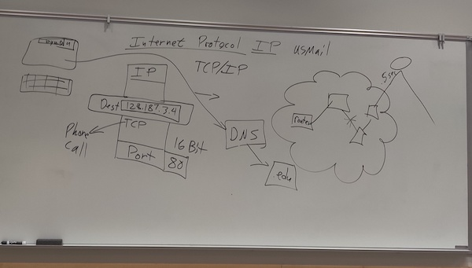
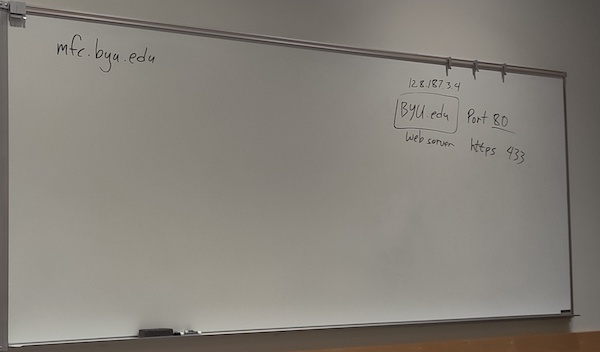

# Week 1 (this is out of order because Mark subbed)
1. Why are you here and why and I here
	- Rah rah stuff---web site that the world can see
3. Very applied, learning tons of new stuff---be ok with that
4. Jump to GITHUB repo and explain
	- Build Simon and "Startup company" in parallel
4. Spend lots of time, focus on mastery, stay up to date
5. Codepen?
	1. HTML is structure, CSS is style, JS is behavior
		- browser renders HTML code
			- it doesn't throw errors, it just does its best and you have to "think like the computer" to debug (but also printf/comment technique)---you have to fix stuff or it will come back to bite you
	2. not all browsers play the same (show rotating border gradient doesn't work in safari problem (what about FireFox?) Chrome has better development tools (according to Mark).  Standardize on Chrome.
	3. cW3schools.com tutorials
	4. JS is dangerous because browsers can capture all kinds of events
6. History
	1. IPv4 (32bit addressing), IPv6 (128bit addressing)
	2. Packet: address, IP, TCP, UDP, port (16bit addressing)
	3. browser
	4. routers
	5. DNS (.com, .edu, .gov, .org, etc.?) subdomain servers
		- "trick is getting other people to use your DNS"
		- weakness to attack---bottleneck
	6. AWS (or whatever: google, Facebook, etc.)
		- virtual machines
	7. what about firewall???
	8. Net neutrality
	9. network address translation (NAT)
		- needed because we haven't adopted IPv6
		- lets us squeeze more machines into IPv4 by multiplexing using ports?
	10. how to register a new machine/address onto the internet?
		- used to be just the address
		- but now more chaotic
	11. punchcards-->personal computer-->virtual servers (command line)
	
	
7. Use google to find answers and don't pay
	1. how to weed out the bad stuff
8. AWS Console
	1. spin up new server whenever
	2. always save to GitHub!!!
	3. use cs260.pem for class stuff so I don't have to chase key files
	4. if you create a new key pair, make sure you download it and save it somewhere (local/safe)
	5. terminate/stop/start server, etc.
	6. launch
	7. paste address into browser (use http?)
	8. manage firewall on security tab
	9. don't be afraid to make mistakes---do several server setups so it's no big
	10. we didn't give it a name yet/DNS address?
		- Route53
		- how to connect to new server(s)? And disconnect from terminated ones?
			- edit Caddyfile
	11. HTTPS certificate
9. SSH and command line
	1. we ssh into this server we are creating
	2. check out index.html
 	3. what is Caddy?
		- edit Caddy file
	4. vi, emacs, nano, (s)ftp
	5. don't worry about firehose syndrome

# Week 2 (this is out of order because Mark subbed)

1. Lee explains hard things like ask yourself first really well
	1. I used to ask the smart guy down the hall, but then I started feeling bad...
	2. lifetime learning skill to say figure it out
2. Three levels of "server":
	1. We can use about:blank, open inspector and write html, css and js right in the browser (local, no server)
	2. you can also run a server on your local machine (local, server)
	3. then, nonlocal server
3. What is websocket? How is it peer-to-peer and how does this give us more power?
4. You CANNOT get behind--> goes from being an awesome class to NO!!!!!!
5. Caddy is a multi-reverse proxy/gateway that figures out which service to serve (we have two: Simon, Startup)
	1. what is the bit about certificates
	2. adding services (instruction)
		- daemon
6. Node.js is just javascript running outside the environment---pull the runtime engine out of the browser and use it from the command line
7. Talk about mental models and their importance
8. OS
	1. Mac/Linux are Posix compliant
	2. Windows isn't--powershell, so need to get gitbash or something else Posix compliant
	3. WSL is windows subsystem for Linux---be careful
9. Console
	1. historical pic
	2. console
		- file explorer (command line)
		- execute programs
	3. deployment script---pushes dev code to prod server
		- show doing it by hand first?
	4. if server changes make AWS (or whatever) fuss about an unknown host, go to .ssh directory (on local machine?) and delete knownhosts? file
10. Visual Studio Code to develop
	1. GitLens extension
	2. Live Server extension
	3. command shift P
	4. command P
11. Use AWS Secrets to store stuff like .pem file if you want to be able to get it from multiple machines, share it, etc.
12. Git
	1. use command line
	2. editor
	3. visualizing git
	4. what is the gitconfig slide for?
13. Github
	1. Don't nest repos

# Week 3
1. Elevator pitch
 	1. passion
	2. what is the problem?
 	3. what is the win?
	4. how you are going to do it?
2. lots of time to answer questions before we covered anything
3. we don't have the browser just read files directly from our HD (if we are just local, especially) because of permissions/security issues/complexity
4. `<!DOCTYPE html>` means we are using HTML 5
5. language attribute just lets google, etc. know what language this is (in case it wants to find that kind of thing or translate or whatever)
6. localhost `127.0.0.1` loopback (LiveServer uses this)
7. TBL is famous WebFather because he thought of anchor tags---anyone can change the world
8. HTML steals from SGML
9. DOM (doc object model) is a tree representation in memory
10. HTML has styling attributes (like width) that are now deprecated by CSS
11. CodePen assumes `<!DOCTYPE html><html></html>` and doesn't include it
12. Make clean structure with as much semantics as possible (for readers, google, etc.)
13. `<forms>` are kind of deprecated by JS now, but still...
14. why does `controls=false` not get rid of controls in Media code?
15. where to find videos, etc that you can access in CodePen?
	1. look at webpage source and link there or just host it locally?
16. Is there cool SVG repos somewhere?
17. In HTML, you have to use multiple pages, one for each "view"
	1. later, we use one page and JS to modify the page content dynamically
18. make the whole simon.html app live coding?  Or is that a bad idea?
19. Show how to deploy
20. cover the whole thing again for startup
21. HTML structure doesn't even (any more) need to worry about placement/location, just the elements/pieces, which can just appear linearly for now
22. Talk about what markup is and what we are doing with it 

# Week 4
1. Don't be late---I can't penalize you enough to reflect how much you are penalizing yourself by getting behind (especially Spr/Su)
2. CSS is just a bunch of rules that select an HTML element and apply declarations to it
	1. Browser introduces some defaulty rules; some CSS devs immediately wipe all those (how?) for better control
	2. look at element/styles in browser dev tools
3. Three ways to style (cascading preference order, highest to lowest)
	1. inline style attribute in HTML (using CSS declaration)---kind of lame/old/coupled/clunky
	2. put the rule separately in HTML
	3. put rules in an external file---best/modular approach
4. That's all there is to it---simple to learn; lifetime to master---it's subtle
5. Bootstrap is a CSS framework we are using???
6. `command /` comments out a highlighted block in Code
7. Some styling notes
	1. `font-size 3em` means 3x the width of the m in the parent font (size)
	2. 3rem is relative to the document, instead of the parent font
	3. start/end instead of left/right for language agnostic placment
8. Box model---In HTML, everything is boxes:content, padding, border, margin---make sure you are on the right element, and look at elements/style box view
9. you can tweak everything in browser debugger---edit as HTML
10. Get to know all the CSS stuff
11. HTML is content/semantic "structure", but not location/relation structure
12. learn more about fonts and animation (we went way too fast)
13. what is the `display` style thing that we skipped?
14. native app and responsive design are different
15. `<meta name="viewport"/>` tells device to not guess scaling
	1. Lots of stuff we do is because of legacy problems (like when pages weren't written well for a device) that still haven't gone away yet
16. Froggy?  What the heck is this?
17. bootstrap framework
18. CDN is a content delivery network---just a URL-accessible repo of stuff?

# Week 5
1. you can do local storage in the browser that survives refresh (it's in simon-js?)
	1. should we put something about it in slides and instruction?  I think it comes later?
2. JS is interpretted; Chrome took over because V8 (its interpreter) is such a good interpreter
	1. Node.js is that interpreter pulled out and wrapped in a command line console program
3. What is a good answer to the difference between compile and interpret---they both create binaries?  Compile once (locally) or "compile" on demand (interpreter)
4. console tab in Chrome Inspect is a JS interpreter---is this true/exact?
	1. sources tab lets you see code, breakpoints, step through, etc.
5. If you want to have liveserver run JS, you need to either tell it to load Node.js, or write some HTML for it to pass to a browser, which will then run it.
6. JS is weakly typed
7. figure out the code thing we did in class for most of the time
8. pop out debugger from the browser
9. what the heck was Lee talking about object vs object vs Object?
	objects like dictionary or map?
10. undefined vs null
	undefined is a type (like object is) and a "value" for that type?
11. why are anon functions cool?
12. Arrow functions
	1. this pointer in JS?  In general?
13. Closure=function with state?
14. factory pattern
15. is numbers.push() an operator or a method?
16. Going through 2.5 hours of code seems like it's boring everyone...Is there a way to cover the basics of JS better than that?
17. objects are collections? sets? of key,value pairs; key must be string (or symbol)
	they can be nested
	methods?
	iterator `in` vs `of`
18. what the heck is up with `spread` and `rest`?
19. map and reduce are confusing for people, especially when we get to the beaches example
	1. why does [p.shore] mean a string?
20. Is destructuring like unzipping in Python?
21. You can only return a single value in JS; destructuring returns lets you pretend that,s not true
22. JS is inline and cryptic and kind of gross
	1. does it make the functionality clear or obfuscate it?

# Week 6
1. JSON is a way to transfer JS objects (and a few other things?) across machines or into DB
	1. how do you pronounce this: funny video by inventor
	2. not a serialization of objects, just a text representation
2. `this._weather` is a convention to tell people it's private; now you can enforce with `#`
3. `get`/`set` makes things appear as properties rather than functions
4. don't need to use `function` keyword inside a class
7. `document` is the name of the DOM in the browser inspecter
8. caniuse.com tells you which JS things you can use in which browser (starting when)
	1. MDN has this info way down at the bottom of articles as well
9. what is an injection attack?
	1. it's not safe to use waffle.innerHTML="<something evil>"
	2. instead use DOM manipulation functions
10. the inspector is using/manipulating the DOM just like we can
11. why is server-side rendering becoming popular again? (makes crawling/understanding pages harder)
	1. client-side rendering is faster and cheaper (for the server owners)
12. MDN has good articles about accessibility issues
13. MDN has lots of events info (of course)
14. Note `class` means something different in html/css than it does in JS (and other programming languages)
15. scope is different (than what?) in JS because lots of things use global scope stuff
	1. `this` is telling you what scope you are in
	2. global `this` is window and it is the default
	3. for `strict`, `this` pointer for a global function is undefined because it has no parent class (it's `window` if not `strict`, but this causes trouble)
	4. scope for arrow function is the original creating environment
	5. scope for events is the element that caused the event, which makes sense
16. get to know the inspection/debug breakpoint, console stuff
17. in web frameworks, we separate based on functionality rather than on file type (html/css/js)
19. understand how module import is using destructuring
20. you have to have `<...type=module...>` to use module stuff in global scope???
	1. but you can leak the module stuff into the global scope directly in the html
21. be aware of common JS modules (used historically), maybe don't use the new versions until you are better with stuff in general
	1. don't really need them when you get to React
22. JS is single-threaded so globals aren't quite as frowned on as they are in most other (multi-threaded) languages
	1. so everything must be async
	2. can't run for a long time
23. Will we install/use Node.js or just always use a browser?  If not, why not?  If so, why not sooner?
24. If I don't fork a CodePen, I can still edit and save---where does it save?
25. In this code snippet
	```javascript
	const color = `hsl(${callCount++}, 100%, 50%)`
	``` 
	why do we need the `${}`? (that makes the inside get evaluated as JS, which makes the decrement happen)  And why is the hsl() stuff wrapped in backquotes? (because the DOM function that uses `color` expects a string argument, I'm pretty sure)
26. The `debounce` example is tricky but cool---the event listener calls the function that `debounce` returns whenever it detects a scroll event; `debounce` gets evaluated first (during interpretation), so that function exists when the first scroll even happens; it's a closure, so the callCount is still in scope, which is how the colors constantly change.  But why do they changes so much with just a `+1` increment? (because even a little bit of scrolling is a lot +1 calls.)
28. JS Scope Closure is still fuzzy, both in how it works and why/how we'd use it...
29. JS DOM
	1. don't really get the injection stuff yet...
	2. in the DOM event listener, where does the `event` parameter come from when the function is called on click (and what does it contain)?
30. JS Async/Await
	1. What does this mean: 
	>By combining async, to define functions that return promises, with await, to wait on the promise, you can create code that is asynchronous, but still maintains the flow of the code without explicitly using callbacks.

# Week 7 (missed for The Bug's graduation)
1. review readings/slides I missed
2. find out what was the review about/how it was done?
3. Can I take the midterm?  Take it.
4. Understand local storage (did that happen this week?  I think so...)
	
# Week 8
1. Bounced all the way back to UX/UI design stuff.  Why? Spring thing.  If we do it, we should do it with CSS (or before even?)
	1. How much UX stuff should we try to do---would the time be better used some other way?  Maybe this should be online but not in class?
2. Another good Leeism: "I'm not trying to take your life away from you; I'm trying to make you awesome in three weeks."
3. UX: start with story and convert to tech---not the other way around
4. Am I making my user work harde than they need to?  What are they really there for?  Not what I want them to be there for
5. Talking through design (not tech) to make sure things make sense and are best (for user)
6. complementary colors and constrast checkers
7. fonts
	1. google fonts (or other repos)
8. prototypr.io?
9. Images should have a critical role, or not be there.
10. Less is almost always more
11. Hick's law---is it really just algorithmic?  That doesn't seem bad/important...
12. So much legal stuff to worry about in building for the world---unavoidable and maybe even good, but even worth it?
13. -------------Web services starting here-------------
14. fetch example on console vs url and looking at network response
	1. it's all the same thing
15. endpoints are kind of like methods on the object that is your service?
16. use CURL on the command line to compare with Network tab on browser debug tools
17. await with promises?
18. Caddy does two things:
	1. load static files
	2. forward requests to another service (reverse proxy/port forwarding for a network request internal to the virtual machine on which Caddy is running)
19. only one service can listen on a port?  So that's why we don't have to specify the service, right?
20. requests used to actually be text, but now binary for efficiency
	1. why does that method not show up in the URL slide just above?
21. HTTP(S) is always client (requests) to server (response)
	response slide has 15 when it should have 14 for length
22. cname in DNS is an alias; the same as a redirect 301/302 status code
23. never assume the browser is enforcing your security (e.g., if you change the timeout in the cookie in the browser, the server should still get you on the original timeout
	
# Week 9
1. CORS is supported/enforced by browser, so if you use curl or your own browser, then all bets are off
	1. if the API you want to hit doesn't allow cross resource sharing, you are hosed
2. Why did Lee's CORS error demo not give the expected error (but just worked, instead)?
3. Be intentional about your design
	1. Core development mindset: design before coding, security, testing
4. endpoints are functions your service exposes
	1. figure out by doing a sequence diagram (or something like it)
	2. API is a bigger/older version of this?
5. what's YAML?
6. What's with the Noun fixation?  That's how Tim set it up?
7. Why talk about RPC if it is deprecated/goofy?
8. What is up with REST?
	1. leverage HTTP as much as possible
9. Why talk about GraphQL?
	1. super flexible for frontend/client
	2. kind of a nightmare for backend/security
10. seems like we should have just talked way more about REST... (5.2 slides)
	1. some examples
11. We picked Node.js because it's popular and uses JS
12. You can just install Node instead of NVM, if you don't want to fiddle with versions (Windows can have trouble occasionally).
13. demo .js file both in chrome and on console (both pasting after running node and making a file and running the file with node)
	1 pbpaste?
14. Look at package code/shell scripts you download before you just run it on your machine
15. what is npm init for?
	1. don't check node_modules into git (put it in .gitignore)
16. you can run your code in Code and have it run Node.js to run/debug
17. in general, you can't run a node.js package in browse, only common ES packages
18. frontend code: debug in browser, backend code: debub in Code/Node.js
19. Node.js democratized web service development---that's why it was/is cool/changed the world
20. Express is a nice wrapper of patterns/etc. for building http web servers (like ??? or tailwind for CSS)
	1. should we call app objects app?
	2. do we need some more complex examples to show how it really works
	3. express advertises itself in the autoheader, which is lame and dangerous (gives attackers info)
21. what is the point of `next` function in middleware callback if it is just called as `next()`?
	1. why don't all middleware pieces include `next()`?
	2. why did the public path in the example note have to be explicit in the url?  Caddy?
22. understand web API stack
23. `app.use(express.static('public'));` replaces using the liveserver in Code
	1. new deployment script now
24. app.router modularizes your endpoints (for organization/understandability/special paths)
25. super confusing flow today (maybe not the case in the actual slides, because we hopped around)
26. PM2 is a daemon process that keeps our http server stuff runnig
	1. auto installed via AMI
	2. shouldn't have to mess with it
	3. but should know it's there
27. recommend not using Windows in general linux/mac is better (don't forget getbash vs. command prompt)
28. why for services are we now doing static hosting from `public`?
29. is the Playwrite/UI/backend testing stuff useful to try to include at the level it is?
	
# Week 10
1. Login assignment should be before database assignment because it's similar but probably easier
2. data stored locally in front end, in memory on backend, finally in DB for persistence (but why not just in file on disk on the backend?). DB is hopefully redundant, elastic, persistent, safe, reliable, etc.  Also, it may offer additional functionality for manipulating data, etc.
3. Relational DBs are kind of a jack of all trades---can do all kinds of data/stuff; more specialized servers for specific kinds of data
4. Mongo DB is schema free, so super flexible but slow (can index on common fields to improve performance); can hang yourself with it, too.  The JS of DBs
5. You don't have to do `npm init`; it just loses some info
6. Mongo uses its own protocol and puts credentials in the URL (which is valid HTML but normally a bad idea but ok in the case of doing this from a secure server environment, as opposed to from your browser)
7. How do you know what to name MongoClient when you deconstruct the return object from mongodb require?
8. check out mailinator
9. Be really prepared if you are going to live demo stuff?
10. spending time doing stuff like signing up for Mongo (which is covered in instructions) is probably not helpful/good use of time
11. don't hardcode credentials in code you are going to commit to (public) github repo. Bots crawl github looking for just that kind of thing.
	1. put them in a file instead
	2. put that file in .gitignore
	3. if you accidentally commit even once, you are hosed (because git doesn't forget anything)
	4. does them having your credentials matter, if you restrict network access?
	5. Database on left of Atlas lets you find your connection string
12. Asynchronous stuff can be goofy---it might take a bit to get in the DB, for example
	1. the process doesn't quit if the DB connection is still open; explicitly close
13. You can insert the same data twice in the same Mongo collection because it make a unique ID for each object
14. commonJS and requires???
15. spend time in class understanding code; not necessarily writing/running it
16. I need the right mental model of promises and async/await
17. check out jq
18. you debug your backend code in Code; you debug your frontend code in browser tools
19. why does simon db only update scores locally?  It must not, right?
20. you can hack the code to cheat the score locally (in browser storage), but also by hacking var sent to DB.  How do we stop that from being possible?  It's hard because the hack is happening on the client, which you don't control.  All your security stuff has to happen on the backend in your secure environment---what can you do there to authenticate the data you are getting?
21. Why can github suddenly not commit this because this file cannot be edited? (somehow got signed out of github after already editing)
22. Dont' do authentication, if you can get away without that wall---more users and more usage
	1. if you do use it, you are responsible for protecting those data/credentials
	2. maybe use sso through another service (google, facebook, etc.)
		- still have to be security-minded (if you think you're good, you're probably not)
		- but don't have to store credentials
23. What is salting a hash?  Is pepper a thing (it came from ethan...)?
	1. if this is really important data, you probably want to turn this over to specialists
24. The front end is a dirty, scary, unsecure place
25. Clients/frontend are really involved with cookies and you can make sure they can't even read them---they are server stuff that lives on your client
26. token stored in cookie lets you stay logged in
	
# Week 11
1. Learn from Simon---not copying, leveraging knowledge and then reinventing/improving
2. React port is the hardest of all deliverables
3. http doesn't work great for peer-to-peer no-request stuff
	1. it was originally created by Tim for requesting papers
	2. Websockets lets a server just give you stuff whenever it wants (rather than when you want/request)
		- clever because it piggybacks on extant HTTP infrastructure
	3. This is how LiveServer works
		- check it out by running and then looking in browser dev tool
4. core tech for JS is http; express wraps that; WebSocket does the same thing?
	1. `ws` is name of package and the name of the protocol
5. don't forget npm install
6. no convention on which port to use for sockets
7. why is your development environment not secure/using HTTP rather than HTTPS?
8. For chat example why do we separate the HTTP server from the WS server?  What does that mean?  How did we not do that in the earlier example from slides?
9. For chat example, why is the fowarding thing happening?
10. Chat example is about 120 lines of code and is basically Twitter!
11. What actually is a factory method?
12. Simon ws stuff is almost exactly the same as chat example.
13. React is Facebook; Angular is Google
	1. Angular is more prescribed, React more like Express in the sense of flexibility
	2. React just changed a bunch of stuff, which made people cranky
	3. React is getting old and bloated?
14. Web frameworks abstracts HTML/CSS/JS 
15. How does Bubble.io relate to web frameworks?
16.separating by functionality makes more sense than separating by file structure (but the file structure isn't completely arbitrary either...)
17.Babel transpilation of JSX happens on the server, not on the client/brower; then static html/css/js can be served normally using middleware
18. We rewrite our whole app into JSX as the last deliverable
19. Babel in Babel or Babel in CodePen?
	1. change JS preprocessor in CodePen to use Babel
20. How does <noscript> know you don't have JS enabled?
21. To scrape modern webframeworks, you have to render it first, just like a browser
22. think of your app as a tree of components
	1. In React, a component is a function
	2. How does CSS play into this way of thinking about things?
	3. classes were the old way to do it, how we just use functions
	4. {} are used for JS escape/execute and also destructuring (that's really dumb)
23. Properties let your stuff react to the state of the system
	1. creates a virtual DOM??? and then projects that into the actual DOM
	2. it's all asynchronous
	3. React sits in between you and the DOM, with state and property variables
24. Vite is a tool to let you use this stuff in your dev/production environment
25. Networking is super important---it gets you everywhere (Lee got first job from a BYU class, and his next 10 from people at his first job)
26. Original model: pages; Now: components---we aren't getting docs anymore, and we have a computer in our pocket---use it
27. Now, it's a single page, which makes debugging easier, sharing data easier---it's actually an application now
28. Live convert simon web framework to simon react seems like a bad idea
29. What the heck is vite, actually?
	1. Why are we "flipping" stuff for dev now, but not for build?
	2. front end code is the first?
	3. tool chain+server+debugger?
30. What is the mental model here?
31. Native apps don't use a browser and the DOM
	1. so react and react-DOM are separate
32. How do bootstrap and React work together?  What is the mental model of what they are relative to each other?
33. In Code, command-shift-L (to select all instantiations of a var), command-D???, etc.
	
## Instruction question/notes (why isn't this and below bold in the raw text, but those above are?)
1. AWS
	- what is TLD (for click server)?
2. Console
	- is it tracert(which doesn't work on my Mac terminal) or traceroute (which does)?
3. GitHub
	- Use the Git functionality of VS Code to add conflictTest.md to Git --> should this say to startup directory or something like that?
	- Better explain "Please tell me who you are" bit
	- What does "Git commits *must* represent all work" mean exactly?
		- atomic commits
		- and none means no credit
4. Webservers
	- Is Go code running on port 80 as it the text says, or port 3000 like the code looks?
	- Not sure how to differentiate service, microservice and serverless function?
	- In slides 2.1, what this the point of the two-slide sequence on servers?
	- A few other 2.* slide questions, if we don't see them in 
	...
5. Domain Names
	- What is the * in the image subdomain.*secondary.top
6. AWS Route 53
	- Why can't we do HTTPS with just and IP address?
	- What contact info should I use for the DNS if I'm using FHTL account (and not my personal one)?
	- if we register a wildcard subdomain, why in the troubleshooting guide does it suggest that the www subdomain won't work?
		- default subdomain for web requests, but since almost all things are web requests...
7. HTML Structure
	- some of the assignment instructions are misleading or don't quite match the output shown
8. Simon CSS
	- Should this not appear here? It seems like maybe a copy/paste error from the startup CSS page?
		- "Update your startup repository notes.md to record, what you modified and added with this deliverable. The TAs will only grade things that have been clearly described as being completed. Review the voter app as an example. Also update your notes.md to record what you learned."
9. CSS framworks assignment seems way too simple?  Can we at least make them drop in more of the components and/or modify some of them?
10. JS String
	the Type instruction says that `string` is a primitive data type, but the String instruction calls it an object and it does have methods?
10.5 JS Type and Construct---what does this title mean?
11. JS Functions says a `function` can have zero or more return statements???
12. JS Arrays assignment is not clearly worded/defined: does the `tester' function iterate over the array (I don't think so) or does it test a a single array element, with the iteration happening in `testAll` (I think so)
	1. Also, is the `some` example supposed to be using the funtion `1<1`?  Or should it be `i<1`?
13. JS JSON conversion output for example doesn't match what CodePen does (with double quotes on names, in particular)
14. JS object and classes assignment
	1.`Phone.Connected` should be `phone.connected`
	2. spec is maybe a bit less clear than it could be?
15. JS DOM assignment
	1. peak height units are different for two tables...?
16. JS Promises
	1. The assignment spec is really short on detail/clarity---not sure what is supposed to be done---maybe just talk more about chaining `.then` statements?
17. URL slide---show two parameters separated by ampersand?
18. HTML Slide (3.1) "Header" is overloaded and misleading
19. show attribute info (also) in DOM tree slide
	1. should we also show JS contributing to the DOM?
20. on common JS Modules slide, should `.\greet` be '.\hello'?
21. in Promises slides, 18-19, why are there two statements in the `p.then` block and why are they separated by a comma and how are they differentiated during execution?
22. Pizza Promise example on slides has extra `.then` for makePizza that the linked CodePen doesn't (and which the assignment asks you to add)
23. Async slides 27 and 28 don't agree with outputs in CodePen, and they are both the same in CodePen: `// [object Promise] {}`
24. And on slide 29, the code throws an error: `SyntaxError: Unexpected identifier 'cow'. Expected ')' to end an argument list. 
 at https://cdpn.io/cpe/boomboom/pen.js?key=pen.js-3dbb7c5b-20f1-78f3-ad44-09488171e5a1:6` (the last reference to `cow`)
25. Same problem for slide 32 with `cattleDrive()`
	- but it works fine, if the `await` in `console.log(await cattleDrive())` is dropped...???
	- though the `Promise {<fulfilled>}` output doesn't materialize...???
26. And the Async/await stuff on slide 25 doesn't work either, of course.
27. For Async slide 33, this: `Remember that async will auto-generate a promise if not explicitly returned` makes it sound like you don't have to write a Promise into your function, even though the example on the slides shows it that way.  Do you or don't you?  If not, we should show it both ways.
	
	
## To Do
- [] play with html tags (from HTML instruction) I'm not familiar with
- [] learn more about bootstrap
- [] fix my design to show some websocket usage case (and the other screen shot?)
- [] fix my html to show some websocket usage case
- [] maybe try doing the CSS myself and then again with bootstrap?
- [] CSS assignments
	-[] startup
- [] JS assignments
	-[] async/await
	-[] startup
- [] go back and compare my (CodePen) solutions to Lee's; also, give them all appropriate titles
- [] Go back over instruction up through CSS and edit typos
- [] Divide instruction/schedule into week chunks
- [] What to about the production deployment stuff in 1.7 slides we didn't cover and I don't understand?
	- ask Lee about the staging/production envs and how the automated/continuous integration works (and why is there still a manual link there?)
	- figure out how to make them aware that it is a thing without spending any realy time on it.
- [] create personal AWS account?

## Questions for me to figure out myself
1. Learn all the stuff about Codepen
	1. How do HTML, CSS and JS know about each other and interact? In Codepen? In general?
	2. know what all the HTML/CS/JS stuff is called/for
2. How can you accidentally pull a Wingate?
3. what all is an AMI?
	1. how to make my own
	2. it's in .github/profile somewhere called EC2AMInotes.md or something close to that
4. Make sure to know what all the EC2 setup stuff is/does
5. why do we already have an index.html file on the new server?
6. what is the 0.0.0.0/??? Last part of this mean?
7. What does all the stuff in Caddyfile mean?
8. What does all the stuff in index.html mean?
9. Can I make my own name for a security group?
10. What is in an AMI and how to build your own?  Will we do it?
11. What is a hosted zone and how does making a duplicate mess things and how do you fix it (the stuff Lee explained about in class)
12. How is Lee making the videos he shows in the slides?
13. should I get Warp?
14. what do * * * mean in traceroute and why does it take so long?
15. is .gitignore just there so you don't have to white list each file (so you can "git add .")?
	1. if I add . And then put ignore something, does that work? Do I have to do the other order?
		- what is -a flag? Vs. git add vs. git commit?
	2. What does this mean-->"...the point of the stage (add) step, is so that you can commit some files while still leaving other..."
16. GitHub
	1. how does it work generally?
	2. how should I be interacting with this as shared resource?
	3. I need to understand how the thing is organized
	4. how do slides relate to instruction links in GitHub?
	5. do I have to fork the repo to make a pull request for typo edits?  Or, can I just edit directly in the main branch?
17. How does PHP relate to html+css+js?
18. What is a CLI?
19. How do IP and domain name fields relate?
20. Why does CodePen seem to not incorporate changes I make?
21. what is the multi-buffer copy/paste thing for mac?
22. Run example password HTML code stuff and look at stuff (including Network stuff) in localhost browser?
	1. forms: instead of post/get (which goes away and returns), we now can just use JS right in the browser
	2. something related to JSON?
23. you can hover over stuff and it will link you to MDN reference page
25. learn about web scraping (and how it relates to JS and browsers)
26. rmdir -rf simon will delete files if not empty
27. why do all checkbox/radio buttens share the same name attribute value?
28. go back and play with the ribbons in CodePen again and actually make changes this time (save files and debug)
29. What is the `integrety` attribute in the bootstrap link and do I need to get my own key value for it?
30. What is a serverless function?
31. Why does 'use strict' not work on the command line?  What are all the bad examples in the instruction file showing?
32. How and I write/modify JS right in the browser debugger? Or can I not? (e.g., I tried to modify the DOM example at the very end of the JS demo file so it would work on the command line (but that requires Node.js, I think?). How does that get called ever?  Or, is it just there so we can copy it over into Code?
33. What does %c, %s, etc. to in `console.log` string formatting?
34. Nail down why `var` is deprecated in JS
35. What is the `symbol` type in JS?
36. How are a `Map` type and an `Object` type different in JS?
37. How do I edit/write HTML (not just style) in the browser debugger? (right-click on element)
38. Why does `('b' + 'a' + +'a' + 'a').toLowerCase();` need the extra `a`?
39. does setTimeout run in Web API (thread?) and throw an event back to the JS (thread?) when it's done?
40. how do you make sure to give up time (release the thread/background)?
41. Given this object example from the JSON instruction:
	```javascript
	const obj = {
  	"class": {
    		"title": "web programming",
    		"description": "Amazing"
  		},
  	"enrollment": ["Marco", "Jana", "فَاطِمَة"],
  	"start": "2025-02-01",
  	"end": null
	}
	```
	how does `stringify/parse` work recursively to preserve inner object type?  Also, why does this not work like you would expect:
	```javascript
	for (const n in obj){console.log(n + ' is ' + obj.n + ' and is of type ' + typeof(obj.n))}
	```
	but this does:
	```javascript
	console.log('class is ' + obj.class + ' and is of type ' + typeof(obj.class))
	```	
42. What does this mean, from Aysnc slides: "Rule for using await: top level module function or called from an async function"
43. Need to better understand promises, await, async and the instruction and slides need to better explain it all somehow
	
	
## Questions for Lee/Mark
	2. dropped "changing root domain" from course?


## Lee teaching Eval
	###Strengths
		- great course design
		- high energy
		- great knowledge/experience
		- great at live coding quickly and efficiently
		- very respectful, and helpful and patient
	###Weaknesses
		- pacing sometimes (too much on easy stuff, rushing on harder/later topics)
		- possibly confusing rabbit holes sometimes?
		- most people aren't coming to class (I think) because all the instruction is online---not sure if that's bad or good...
		- maybe spends time on/allows a bit too many off-topic/weird questions that everyone else doesn't want to hear?
		- maybe over does the enthusiasm (chanting HTTP)?
		- sometimes history rabbitholes are more confusing than helpful (when I started doing web programming we didn't have http...)
		- pacing (but in Spring first time, so probably tricky)
		- how to make CodePen solutions useful/available, without letting students just copy/paste for assignments
	
## Lunch topics
1. How are we suppose to share/interact with course GitHub repo? 
	- Do I clone the GitHub repo for my class?
	- Are the slides a shared resource, or should we all be doing our own (approach)?
	- How do we share the resource?
2. Is working in class a good thing or no?  Should they all bring laptops for doing so?
3. Are Simon assigments just part of the 60% that is startup grade? Or should they be separate?
4. Should required readings be enforced?
5. How does late work policy work and is it actually beneficial?  How often do people get hosed by getting behind compared to getting partial credit when due?  Since we are building on earlier stuff, is there even a way forward without late leniency?
6. Is it ok if almost no one comes to class (because everything is already online, or???) midway through spring about 40% attending
7. What is the point of in class if the slides and all instruction is available online?
8. How does online course interact with inperson course (same TAs, same assignments?, same due dates?)

## Pedogogical Blatherings
1. Is Menti.com a useful tool?
2. What about a high-level diagram that shows the big picture?
	1. there's one on GitHub about the class tech (mostly), and it should be in the slides?
	2. should we have one with underlying internet stuff at the level Mark had on the board as well?
	3. and how do those two relate?
3. Can my PhD students get paid enough to TA this course? Yes.
4. Does the course view/organization in GitHub/Canvas make sense?
5. What is the point of in-person class, if the slides and (more critically) all the talking for the slides (instruction) is online (is it, in fact)?
	1. should I use (some) different slides?
	2. should I be saying (some) other stuff for slides in class?
		- a little bit of inspiring rah rah (TBL is just one regular dude), some useful info (leave rest to be read), demo???
6. How to balance answering questions with moving along (especially when they are remedial, and we've already talked about it)?
7. Watch out for pacing (duh)
8. HTML isn't about structure; it's about content?
9. Should we have a "personal" server to demo stuff in class (so we don't have to show stuff on the main class server)?
10. Start class by showing what they will hopefully know (overall picture, a bit of each thing, commandline, debugging, etc.) and what they can't possibly expect to know (html/cs/js/frameworks/react)
11. not my job to know all the HTML/CSS/etc.  My job is to give mental models, work flow, how to debug/problem solve, find answers, etc.
12. how to balance focusing on concepts/mental models with actual implementation/code?
13. how much of this class could be done just using bubble.io (what Spencer is using for "lowcode")?  How would the experience be different?  What couldn't be done in bubble.io?  How much "tax" does bubble impose for server hosting, etc.?

## Assignment stuff
1. CONSOLE: xxyy
2. GITHUB: https://github.com/venturadan/startup
3. CODEPEN: 
4. STARTUP Spec: https://github.com/venturadan/startup
5. AWS EC2: http://44.211.87.91
6. HTTPS: https://wafflesandcheese.click
7. HTML Structure: https://codepen.io/venturadan/pen/QWZrMox
8. HTML Input: https://codepen.io/venturadan/pen/PoyeJoO
9. HTML Media: https://codepen.io/venturadan/pen/ZEqoXBg
10. HTML startup: https://startup.wafflesandcheese.click
11. CSS Practice: https://codepen.io/venturadan/pen/XWxPmLp
12. CSS Flex: https://codepen.io/venturadan/pen/jOevaLJ
13. CSS Frameworks: https://codepen.io/venturadan/pen/jOevzpo
14. CSS startup: 
15. JS Arrays: https://codepen.io/venturadan/pen/oNaQozg
16. JS Objects and classes: https://codepen.io/venturadan/pen/qBJLaQX?editors=1112
17. JS DOM: https://codepen.io/venturadan/pen/abRPwbR
18. JS Promises: https://codepen.io/venturadan/pen/VwEqVge


